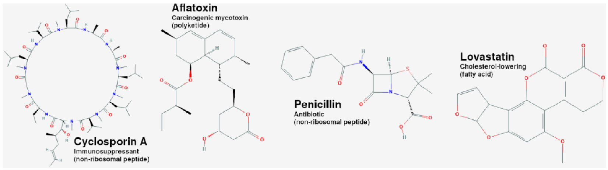
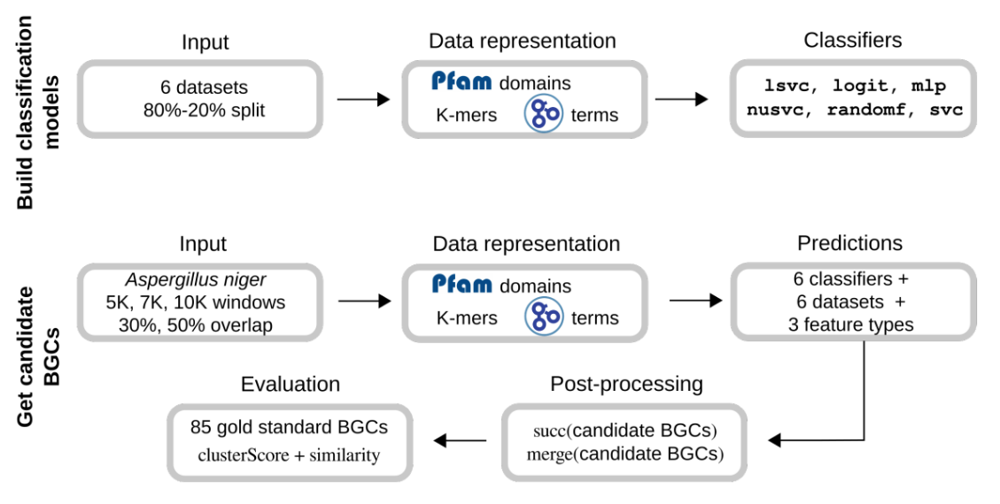
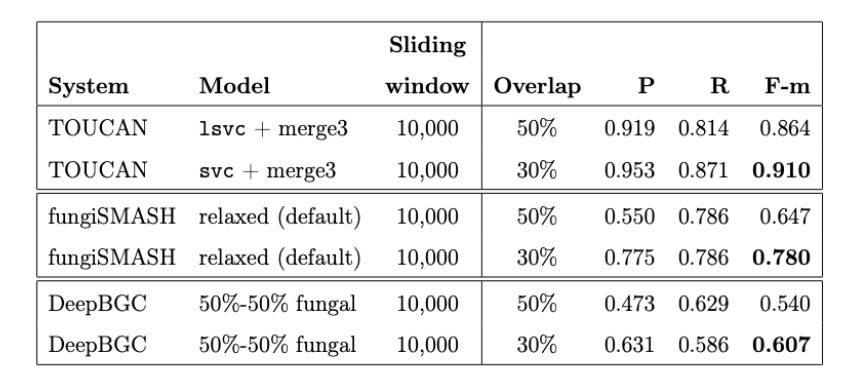
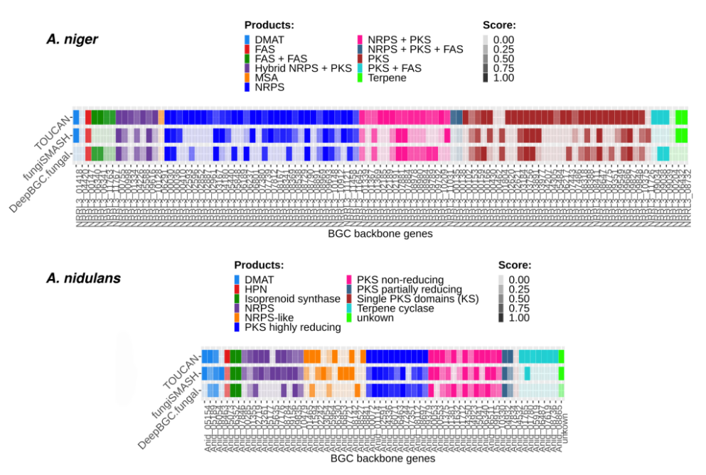
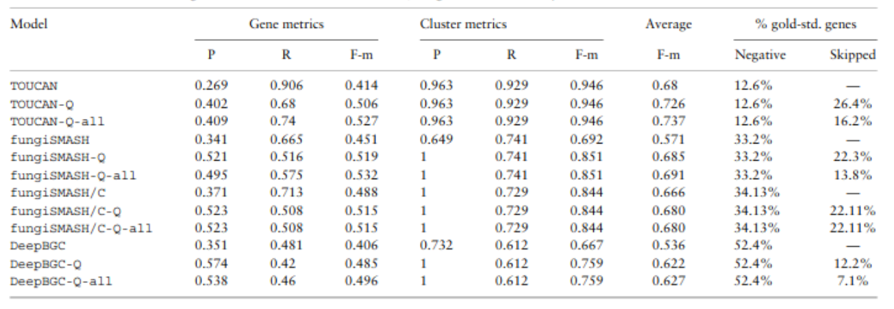

.. Trouver des BGC avec l'apprentissage par renforcement documentation master file, created by
   sphinx-quickstart on Sun Jan 29 21:01:15 2023.
   You can adapt this file completely to your liking, but it should at least
   contain the root `toctree` directive.

Identifier des gènes biosynthétiques avec l'apprentissage par renforcement
==========================================================================

.. bibliography:: references.bib
   :filter: False

On découvre avec le génome de plusieurs organismes des composés chimiques
utiles pour des activités humaines. Parmi ceux-ci, les métabolites secondaires
présents, entre autres, chez les plantes et les champignons, ont des
applications variées allant de la médecine à l'agriculture :cite:`kwon2021`.
Des équipes de recherche s'efforcent de trouver des manières d'identifier
davantage de tels composés en explorant différentes approches. Cette page
présente un survol de techniques utilisées dans ce but.

.. contents:: Contenu
   :depth: 2
   :local:
   :backlinks: none

Mise en contexte
----------------

Les métabolites secondaires, des composés essentiels à la survie de plusieurs organismes, sont utilisés dans des activités industrielles et scientifiques :cite:`almeida2022`. On retrouve ces composants dans de nombreux produits tels que la caféine, la nicotine, la carotène ainsi que dans de nombreux produits pharmaceutiques tels que la pénicilline, la morphine et les antibiotiques. La découverte de métabolites secondaires peut donc aider l’industrie à développer de nouveaux médicaments ou traitements. Les champignons représentent une riche source de métabolites secondaires, mais l’identification de ces composés représente un défi. Afin de faciliter leur découverte, Almeida et al. ont développé une technique basée sur l’apprentissage par renforcement. La figure suivante présente quelques exemples de médicaments issus de métabolites secondaires produits chez des champignons.


   
   Exemples de métabolites secondaires chez les champignons (Almeida)

Afin d’identifier les métabolites secondaires, il faut se pencher sur les voies biosynthétiques qui les produisent et qui sont encodées dans des groupes de gènes dans le génome des organismes nommés **groupes de gènes biosynthétiques** ou BGC. La diversité génomique des champignons rend l’identification des BGC très difficile, même avec des outils de pointe, les cures manuelles ou les caractérisations expérimentales faites par des experts.

Les métabolites secondaires sont généralement composés minimalement d’un squelette enzymatique, qui définit les principaux composants chimiques à produire, et d’une enzyme d’adaptation capable de générer des variants en modifiant les composants principaux du groupe. Ils peuvent aussi contenir des facteurs de transcription spécifiques, des transporteurs et des protéines hypothétiques. La figure suivante présente des exemples de BGC qui permettent de synthétiser des métabolites secondaires.

.. figure:: figures/figure2.png
   
   Exemples de BGC chez les champignons (Almeida)

Problème de recherche
---------------------

L’objectif principal du projet de recherche est de faciliter la découverte de BGC chez les champignons.

Identifier des BGC est une tâche ardue pour plusieurs raisons. D’abord, la diversité génomique des champignons est élevée, même à l’intérieur d’une seule espèce. Une étude comparative sur des espèces d’*Aspergillus* a démontré que plus de 50 % du génome des champignons varie entre celles-ci :cite:`kjaerboolling2020`. De plus, il est difficile de définir précisément les limites in silico ( avec des modèles informatiques) des BGC. S’ajoute à cela l'ambiguïté fonctionnelle des gènes voisins des BGC. Par exemple, certains gènes voisins des BGC peuvent montrer un rôle fonctionnel pertinent mais pas nécessairement appartenir au BGC le plus proche ou prendre part à la production de métabolites :cite:`almeida2022`. La validation des BGC in silico par des experts est nécessaire à cette analyse et constitue une tâche complexe. Par la suite, les BGC candidats doivent être expérimentalement caractérisés. Un important nombre de voies métaboliques des BGC candidats sont silencieuses ou très peu exprimées dans des conditions de laboratoire, ce qui peut empêcher la prédiction de BGC in silico et même la production de composants de métabolites secondaires :cite:`almeida2022`.

On décompose la question de recherche en trois sous-questions :

#. Comment obtenir les données pour la découverte de BGC fongiques?
#. Comment concevoir un outil qui permet la découverte de BGC fongique?
#. Comment optimiser les prédictions des BGC fongiques en tenant compte des connaissances des experts?

Répondre à ces questions soulève trois défis majeurs : la rareté des données, la prédiction des régions de BGC et l’optimisation des prédictions des BGC.

- **Rareté des données** : Étant donnée la difficulté d’identifier des BGC chez les champignons, le nombre de composants déjà cartographiés et expérimentalement caractérisés est très limité. Parmi les bases de données de BGC publiques, le nombre de BGC fongiques est très bas comparativement aux bactéries. Par exemple, les bases de données MIBiG et antiSMASH contiennent respectivement 84,3% et 98,1% de données d’eucaryotes contre 15,7% et 1,9% de données pour les bactéries et archées. De plus, les régions BGC elles-mêmes sont rares dans les génomes des champignons et s’élèvent, selon une étude des données du MIBiG, à  1% du génome total, en moyenne. À cause de cette rareté, il est difficile de déterminer quelles régions non BGC pourraient contribuer à la découverte de BGC. Tous ces défis complexifient le développement d’outils et de méthodes  robustes  pour découvrir des BGC :cite:`almeida2022`.
- **Prédiction des régions BGC** : Identifier des candidats comme des régions de BGC est une étape importante pour la caractérisation et la reproduction des composants de métabolites secondaires. Généralement, cette tâche se base sur  des approches bioinformatique et de calcul biologiques développé pour la découverte de BGC, mais la rareté des données ainsi que la diversité de la caractérisation génomique de ces groupes ont un impact direct sur le développement de ces approches.
  - D’une part, les approches précédentes se basent principalement sur des règles ou des manuels de données curatives. Toutefois, ceux-ci résultent en des approches qui surestiment les limites génomiques des BGC ou qui ne sont pas capables de généraliser correctement les prédictions de nouveaux candidats. S’ajoute à tout cela des coûts supplémentaires lorsque les limites surestimées sont traduites lors de l’étape de la caractérisation expérimentale. Finalement, un autre défi consiste à distinguer les composants nouvellement découverts des composants déjà identifiés.
  - D’autre part, les approches pour découvrir des BGC doivent souvent tenir compte de l’équilibre entre la robustesse de la méthode, qui permet d’identifier des BGC déjà connus au sein de nouveaux groupe, et la nouveauté, qui permet de découvrir de BCG avec des structures moins communes au détriments de trouver des structures déjà connues :cite:`almeida2022`.
- **Optimisation de la prédiction des BGC** : Les BGC sont essentiellement composés de gènes qui codent pour un squelette enzymatique et d’une enzyme d’adaptation. Toutefois, les composants des BGC varient significativement au niveau des gènes impliqués dans les voies métaboliques qui synthétisent les composants des métabolites secondaires. La compositions des groupes peut varier selon la présence ou l'absence de certains composants et d’autres fois selon la localisation ou les composants apparaissent, telles que des régions de BGC voisin qui se chevauchent ou qui s’étendent sur plusieurs chromosomes :cite:`almeida2022`. Finalement les BGC peuvent présenter des composants spécifiques à un groupe, ce qui peut contribuer à rendre l’optimisation des prédictions encore plus complexe.

Outils de détection des BGC
---------------------------

On peut diviser les approches de découverte des BGC en trois catégories :cite:`almeida2022` :

- Les **approches basées sur les données** consistent à analyser les informations contenues dans le génome des organismes en portant particulièrement attention aux alignements de séquences, à l’expression des gènes et aux cooccurrences. Ces techniques requièrent un plus grand effort manuel pour le traitement des données.
- Les **approches probabilistes** sont basées sur les chaînes de Markov cachées en combinaison ou non avec d’autres méthodes. Par exemple, l’outil fungiSMASH s’appuie sur les chaînes de Markov de différentes bases de données (Pfam, TIGRFAM) pour extraire des domaines de protéines d’intérêt.
- Les **approches basées sur l’apprentissage automatique** s’appuient généralement sur des techniques d’apprentissage supervisé. Par exemple, DeepBGC utilise un réseau récurrent (BiLSTM) et l’ensemble de données Pfam pour prédire les régions génomiques appartenant à des régions BGC et non-BGC. Un classificateur de type forêt aléatoire est utilisé pour identifier des métabolites secondaires candidats.

La plupart des approches créées pour identifier des BGC visent d’abord le génome des bactéries parce qu’il existe davantage de données liées à ces organismes. On compte moins de techniques pour les BGC des champignons étant donné le manque de données.

Les techniques d’apprentissage par renforcement (AR) sont moins communes que les approches basées sur l’apprentissage supervisé pour traiter des données biologiques. Des approches de type AR ont servi à réaliser des tâches d’optimisation comme l’alignement de séquences :cite:`mircea2020`, les réseaux régulatoires de contrôle de gènes :cite:`imani2018`, la conception de séquences d’ARN :cite:`eastman2018` et l’assemblage de composés pour les médicaments :cite:`gottipati2020`, :cite:`almeida2022`. Il est donc logique d’appliquer cette technique à l’identification de BGC.

Techniques d'apprentissage supervisé
------------------------------------

Par l’apprentissage supervisé l’objectif est d’apprendre d’une fonction :math:`f: X \to Y`, avec une entrée :math:`x \in X` qui produit une sortie :math:`y \in Y` pour une tâche donnée. Pour déterminer cette transformation, un algorithme échantillonne :math:`E` à partir d’un lot d’exemples :math:`D(X,Y)`. Le lot de données :math:`D` est composé de pairs d’entrées-sorties dans lesquels x sont des caractéristiques extraites de données et y sont des labels ou catégories. Un algorithme d’apprentissage est ajusté à D en minimisant une fonction d'erreur :math:`l(y,y’)` où y’ est un label prédit à partir d’une entrée x :cite:`mitchell1997`, :cite:`almeida2022`. Plus simplement, l’apprentissage supervisé apprend à classifier des données en s’appuyant sur des exemples de données classifiées.

L’utilisation d’un cadre pour l'apprentissage supervisé pour les BGC fongiques soulève trois questions importantes :

1. En prenant en considération de nouvelles données, est-ce que les approches basées sur l’apprentissage par supervision nous permettent de supporter la découverte de BGC fongiques?
2. Comment modéliser la découverte de BGC fongiques comme un problème d’apprentissage supervisé?
3. Est-ce que ces modèles seront capables de fonctionner en dépit de la diversité génomique et de la rareté des données?

L’étude cherche à déterminer si l’apprentissage supervisé permet d’atteindre les objectifs suivants :

- Concevoir la découverte de BGC en terme d’une classification binaire
- Analyser une variété de ratios BGC et non BGC dans les jeux de données
- Évaluer les paramètres qui se chevauchent et les paramètres d’analyse fenêtre
- Étudier la performance de différents classificateurs
- Comparer les performances de l’outils avec les outils les plus performants déjà existants

Les approches dérivés de technique d’apprentissage par supervision ont démontré de bonnes performances pour la prédiction de BGC bactériens. Par contre, cette méthode n’a pas été utilisée jusqu’à présent pour identifier les BGC fongiques. Des méthodes telles que RiPPMiner et DeepBGC qui ont été développées pour les bactéries ont démontré des résultats décevants lorsque appliqué à des données fongiques. Ceci suggère que les méthodes de découverte de BGC développées pour les bactéries ne semblent pas être fonctionnelles pour les champignons à cause de la grande diversité des BGC fongiques qui semble varier même entre espèces très proches. De ce fait, il est important de développer des approches de découvertes de BGC pour les champignons en prenant en considération les caractéristiques des BGC fongiques, tel que la grande diversité, la composition des BGC mais aussi la longueur des BGC et des génomes qui sont plus grands que ceux des bactéries. C’est pour cela que TOUCAN a été proposé, une structure d’apprentissage supervisée qui s’attaque à la découverte de BGC chez les champignons et qui est basée sur la combinaison de caractéristiques biologiques: les k-mers, les domaines protéiques, et la gene Ontologie pour représenter les motif protéiques et les fonctions pertinentes des BGC fongiques :cite:`almeida2022`.

Les modèles de classifications de TOUCAN ont été construits en se basant sur un ensemble de 6 bases de données de BGC fongiques avec une distribution variable, un total de six classificateurs et des méthodes de post-traitement. Pour construire et valider les modèles, une division aléatoire de 80% des données est faite pour entraîner les modèles et 20% pour leur validation. Pour représenter les données des BGC fongiques en termes de vecteurs caractéristiques, l’étude a utilisé les caractéristiques biologiques hétérogènes suivantes : k-mers, les termes GO et les domaines protéiques pfams. En terme de classificateurs les six suivant ont été utilisés : 

- trois Support Vector Machine (SVM) classificateurs: C-Support Vector (svc), Linear Support Vector (lsvc), and Nu-Support Vector (nusvc) classifiers
- les trois autres sont: Multilayer Perceptron (mlp), Logistic Regression (logit) and Random Forest (randomf)

Pour les post-traitement et la validation du modèle, six ensembles de données d’un génome de Aspergillus Niger sélectionnés manuellement ont été utilisés. Des régions de 5K, 7k, ou 10k d’acides aminés avec un chevauchement de 30% ou 50% ont été extraits du génome pour la validation :cite:`almeida2022`.

Le graphique suivant résume l’ensemble de la démarche et des paramètres utilisé pour développer la structure TOUCAN : 


   
   Structure de l’outil TOUCAN

Il en résulte que TOUCAN est significativement supérieur en termes de performance que les autres outils déjà existant, à savoir fungiSMASH et DeepBGC. La table ci-dessous, montre clairement qu’en termes de performance TOUCAN est supérieur à ses paires  dans les 3 caractéristiques mesurées, P (précision), R ( Recall) et F-m (Fold measure) :cite:`almeida2022`.


   
   Comparaison des performances de TOUCAN, fungiSMASH et DeepBGC

L’analyse de la présence d’enzymes de structures dans les gènes ayant une prédiction TP (True Positive) à aussi été faite. Les enzymes de structures sont considérées comme étant le cœur des BGC, jouent un rôle clé dans la biosynthèse permettant de définir les composants à produire :cite:`almeida2022`. Nous pouvons voir que TOUCAN a mieux performé que fungiSMASH et DeppBGC pour *A. niger* comme le montre l’image suivante :


   
   Prédictions des modèles TOUCAN, fungiSMASH et DeepBGC

Pour conclure cette section, on peut dire que TOUCAN à mieux performer que les derniers outils existants, fungiSMASH et DeepBGC, pour *A. niger*. Les résultats obtenus sont reproductibles pour d’autres champignons tel que *A. nudilans*. L’outil permet d’améliorer la couverture de gènes BGC. TOUCAN obtient plus de BGC contenant des enzymes de structures, que les autres outils, et favorise la découverte sur des génomes nouvellement séquencés. Finalement, TOUCAN a le potentiel de sur-prédire les limites.

Techniques d'apprentissage par renforcement
-------------------------------------------

L'apprentissage par renforcement consiste à entraîner un modèle en simulant des
interaction avec un environnement. En expérimentant différentes actions dans un
milieu virtuel, un *agent* apprend quelles *actions* poser pour atteindre un
*état* voulu :cite:`chaudhuri2019`. Les *récompenses* sont des valeurs qui
guident l'agent dans son entraînement quand il se rapproche de l'état voulu.

Par exemple, si l'on utilise l'apprentissage par renforcement pour apprendre à
un robot comment marcher en ligne droite, on peut considérer que :

- **L'agent** est le robot.
- **L'environnement** est le milieu dans lequel il se déplace.
- Les **états** représentent toutes les configurations possibles du robot et sa
  position dans l'espace.
- Les **actions** de l'agent consistent à bouger ses articulations.
- Les **récompenses** mesurent à quel point l'agent accomplit ses tâches. Par
  exemple, avancer pourrait entraîner une récompense positive tandis que tomber
  ou reculer entraînerait une récompense négative.

L'algorithme Q-learning est une manière d'entraîner un agent. Soient :

- Un ensemble d'états :math:`S` composé de :math:`n` états :math:`s`.
- Un ensemble d'actions :math:`A` composé de :math:`m` actions :math:`a`.

Un agent dans un état :math:`s_t` peut poser une action :math:`a_t` pour passer
à un état :math:`s_{t+1}`. À chaque transition d'état, l'agent observe une
récompense :math:`r_t`. Le but du Q-learning est d'apprendre quelle est la meilleure action à
sélectionner lorsque l'agent est dans un état donné. Pour ce faire, on cherche
à élaborer une **fonction de qualité** :math:`Q` qui calcule la qualité
(c'est-à-dire, la tendance à produire des récompenses positives) de chaque
combinaison état-action. L'équation :eq:`qlearning` présente l'algorithme
utilisé pour calculer la fonction de qualité :

.. math:: Q_{t+1}(s_t, a_t) \leftarrow Q_t(s_t, a_t) + \alpha \{ r_t + \gamma \cdot argmax[Q(s_{t+1}, a)] - Q(s_t, a_t) \}
   :label: qlearning

où :

- :math:`\alpha` est le facteur d'apprentissage. Plus
  :math:`\alpha` est élevé, plus l'algorithme privilégie les informations
  récentes par rapport aux informations anciennes. On doit observer
  :math:`0 < \alpha < 1`.
- :math:`\gamma` est le facteur d'actualisation. Plus :math:`\gamma` est élevé,
  plus l'algorithme privilégie les récompenses à long terme par rapport aux
  récompenses à court terme. On doit observer
  :math:`0 < \gamma < 1`.
- r représente la récompense observée quand l’agent pose une action.

On peut utiliser un autre hyperparamètre, :math:`\epsilon`, qui représente le
facteur d'exploration. Plus :math:`\epsilon` est élevé, plus l'algorithme a
tendance à poser des actions aléatoires qui peuvent lui permettre de découvrir
des combinaisons état-action menant à de plus grandes récompences. On doit
observer :math:`0 < \epsilon < 1`. Souvent, on commence l'entraînement avec une
valeur de :math:`\epsilon` élevée pour explorer l'environnement. À mesure que
la fonction de qualité converge vers une forme optimale, la valeur de
:math:`\epsilon` diminue.

Exemple d'utilisation du Q-learning
```````````````````````````````````

Cette section présente une application du Q-learning pour résoudre un problème
simple disponible dans la bibliothèque ``Gymnasium``, un projet destiné à
étudier l'apprentissage par renforcement :cite:`gymnasium2023`.

L'environnement ``FrozenLake-v1`` de la bibliothèque permet de tester des
algorithmes. Il est composé d'une grille de seize cellules. L'agent doit se
déplacer d'une position de départ vers une cible en évitant des obstacles.
Atteindre la cible entraîne une récompense de ``1,0``.

Au début de l'entraînement, l'agent ne sait pas quelles actions sélectionner
pour atteindre l'objectif. Il pose des actions aléatoires qui ne lui permettent
pas d'obtenir des valeurs de récompense, comme le montre l'animation suivante :


   
   Exploration aléatoire de l'environnement

Pour améliorer les performances, on calcule la fonction de qualité en suivant
l'algorithme Q-learning. Le code Python suivant montre comment appliquer la
fonction :eq:`qlearning` en interagissant avec l'environnement.

.. code-block:: python
   :linenos:

   ALPHA = 0.5 # Facteur d'apprentissage (vitesse de changement de la valeur Q)
   GAMMA = 0.9 # Facteur d'actualisation (importance des récompenses futures)
   N_EPISODES = 1000 # Nombre d'essais

   # Créer l'environnement d'apprentissage et la table de qualité.
   env = gym.make("FrozenLake-v1", is_slippery=False)
   qtable = np.zeros((env.observation_space.n, env.action_space.n))

   # Entraîner le modèle en réinitialisant l'environnement à chaque épisode.
   for _ in range(N_EPISODES):
       state = env.reset()[0]
       while True:
           # Sélectionner l'action avec la meilleure qualité. Si aucune action
           # n'a été évaluée pour l'état, choisir une action aléatoirement.
           if np.max(qtable[state]) > 0:
               action = np.argmax(qtable[state])
           else:
               action = env.action_space.sample()
           # Interagir avec l'environnement et mesurer la réponse.
           new_state, reward, terminated, truncated, info = env.step(action)
           if truncated or terminated:
               break
           # Actualiser la table.
           q_0 = qtable[state, action]
           q_1 = np.max(qtable[new_state])
           qtable[state, action] += ALPHA * (reward + GAMMA*q_1 - q_0)
           state = new_state
   env.close()

On obtient la table de qualité suivante :

+------------------+-----------------+----------------------------------------------------------------------------------+
| Table de qualité |                 | Action (direction vers laquelle se déplacer)                                     |
+==================+=================+====================+====================+=====================+==================+
|                  |                 | :math:`\leftarrow` | :math:`\downarrow` | :math:`\rightarrow` | :math:`\uparrow` |
|                  |                 |                    |                    |                     |                  |
+------------------+-----------------+--------------------+--------------------+---------------------+------------------+
| **État (position | :math:`(0, 0)`  | :math:`0,0`        |  :math:`0,59`      | :math:`0,0`         | :math:`0,0`      |
| de l'agent)**    +-----------------+--------------------+--------------------+---------------------+------------------+
|                  | :math:`(0, 1)`  | :math:`0,0`        |  :math:`0,0`       | :math:`0,0`         | :math:`0,0`      |
|                  +-----------------+--------------------+--------------------+---------------------+------------------+
|                  | :math:`...`     |                    |                    |                     |                  |
|                  +-----------------+--------------------+--------------------+---------------------+------------------+
|                  | :math:`(3, 2)`  | :math:`0,0`        |  :math:`0,0`       | :math:`1,0`         | :math:`0,0`      |
|                  +-----------------+--------------------+--------------------+---------------------+------------------+
|                  | :math:`(3, 3)`  | :math:`0,0`        |   :math:`0,0`      | :math:`0,0`         | :math:`0,0`      |
+------------------+-----------------+--------------------+--------------------+---------------------+------------------+

Par exemple, on voit que l'algorithme a déterminé que la meilleure action à
sélectionner lorsque l'agent se trouve dans la cellule :math:`(0, 0)` consiste
se diriger vers le bas (:math:`\downarrow`). En suivant ce modèle, l'agent
peut alors se déplacer dans l'environnement sans rencontrer d'obstacle pour
atteindre son but.


   
   Déplacement dans l'environnement après apprentissage par Q-learning

Application du Q-learning à l'identification des BGC
````````````````````````````````````````````````````

L’algorithme Q-learning possède les caractéristiques suivantes :
- Il est sans modèle, c’est-à-dire qu’il ne construit pas de modèle de transition des états mais uniquement une fonction de récompense.
- Il est en ligne, c’est-à-dire que les données sont utilisées dans un ordre séquentiel plutôt qu’en lots de données.
- Il est incrémental, c’est-à-dire qu’il est actualisé à chaque fois qu’une donnée d’entrée est traitée par l’algorithme.

Ces caractéristiques rendent le Q-learning adapté à des tâches d’optimisation de prises de décisions en biologie :cite:`almeida2022`. La simplicité de cet algorithme constitue un avantage supplémentaire qui diminue le temps requis pour réaliser le code source.

Dans le contexte d’identification des BGC, on peut **entraîner** un modèle d’apprentissage par renforcement en considérant les aspects suivants :

- L’environnement est composé d’un ensemble de domaines de protéines Pfam réparties en trois catégories. L’ensemble de données contient un nombre égal de groupes de gènes contenant des BGC que de groupes n’en contenant pas parce que cette distribution donne empiriquement les meilleurs résultats.
  - Domaines munis de BGC
  - Domaines sans BGC
  - Domaines condidats pour des BGC
- Les actions consistent à classifier les composants et à définir correctement les frontières entre les groupes. On utilise deux actions : :math:`A = {garder, passer}`, qui correspondent à retenir un gène comme BGC ou à l’éliminer.
- Les récompenses sont assignées lorsque les gènes sont correctement identifiés et retirés lorsque l’agent commet des erreurs. Une valeur de récompense est ainsi calculée chaque fois que l’agent sélectionne une action.

En apprentissage par renforcement, un épisode désigne l’application de l’algorithme à toutes les données de l’ensemble. Il faut utiliser plusieurs épisodes pour laisser l’algorithme converger vers une solution. L’implémentation de référence utilise 500 épisodes pour l’entraînement.

Pour améliorer la précision du modèle, l’outil s’appuie sur des annotations fonctionnelles qui consistent à identifier le rôle de différentes parties d’un groupe de gènes. Par exemple, on peut annoter certaines séquences correspondantes au squelette enzymatique, à des facteurs de transcription, à des transporteurs ou à des protéines. Le squelette enzymatique est considéré comme essentiel dans la synthèse des BGC. Un total de 85 gènes de *Aspergillus niger* ont été manuellement annotés pour surligner la fonction de chaque partie des BGC. Trois stratégies permettent ensuite d’améliorer les décisions prises par l’agent :

- :math:`averageAction` : traite les gènes manquants dans les domaines de Pfam.
- :math:`neighborWeight` : gère la présence d’annotation dans les gènes voisins.
- :math:`dryIslands` : gère l’absence d’annotations.

Les **tests** du modèle sont effectués en prédisant la nature d’un groupe de gène (BGC ou non BGC) avec le Q-learning et en la comparant avec les résultats de trois outils :

- TOUCAN
- fungiSMASH
- DeepBGC

Plus précisément, on utilise le génome d’un champignon dont l’utilisation est répandue dans les processus industriels et en biotechnologie : *Aspergillus niger*. Pour obtenir des BGC candidats, on extrait des séquences de 10 000 acides aminés. Les régions correspondant aux séquences d’acides aminés se chevauchent à 30 %. Le chevauchement des régions aide à prévenir la fragmentation de l’ensemble de données pour éviter d’analyser un même gène en deux fenêtres distinctes. La catégorie d’une région (BGC ou non BGC) est déterminée par un vote de consensus entre les trois outils.

L’apprentissage par renforcement mène à des performances supérieures aux techniques précédemment développées. On utilise trois métriques : la précision, l’exhaustivité et la mesure F. Le tableau suivant montre les performances observées :


   
   Amélioration des performances de TOUCAN, fungiSMASH et DeepBGC avec l’apprentissage par renforcement (Almeida)

Dans chaque cas, l’application du Q-learning augmente les performances de la méthode utilisée. La combinaison de l’apprentissage par renforcement et des annotations fonctionnelles entraînent les meilleurs résultats.

Bien qu’elle permette d’améliorer les résultats, la méthodologie comprend des limites.

- L’annotation manuelle des données de Aspergillus niger constitue une faiblesse du modèle parce qu’elle représente un effort considérable. Cette approche limite les applications possibles de l’outil parce que la rareté des données annotées empêche d’entraîner efficacement des modèles d’apprentissage automatique.
- L’utilisation d’une fenêtre de taille fixe pour analyser les séquences est utile pour analyser des séquences inconnues, mais chez certains organismes, une fenêtre de taille variable pourrait être plus appropriée.
- Les méthodes basées sur l’apprentissage profond pourraient être plus appropriées pour détecter des BGC. La rareté des données empêche les techniques de générer des résultats satisfaisants, mais si davantage de séquences chez les champignons deviennent disponibles, les réseaux neuronaux pourraient entraîner de meilleurs résultats.

Conclusion et directions futures
--------------------------------

On peut conclure dans un premier temps que cette étude a permis de déterminer des nouveaux ensembles de données de références pour supporter les approches permettant d’identifier spécifiquement les BGC fongiques. Ces données représentent la diversité génomique, et permettent d’explorer l’usage d’orthologues. Par la suite, l'outil TOUCAN basé sur une approche d’apprentissage par supervision, a été développé et est spécifique à la prédiction des BGC fongiques. Cet outil a permis d’améliorer, en moyenne, de 26% les groupe  f-m et de 10% la couverture en termes d’enzymes de structure chez les BGC comparativement aux outils existants. Afin d’optimiser la prédictions des BGC fongique faites par TOUCAN, l’outil a été amélioré en implémentant une approche basée sur la combinaison de l’apprentissage supervisé et d’annotation fonctionnelle. Une amélioration de 15% en termes de précision de gènes et de 25% en termes de précision de groupe a été constatée. 
Plusieurs potentiels voies d’exploration et d’amélioration sont possibles pour l’avenir. Tout d’abord, il serait possible d’utiliser les méthodes développées plus haut pour de nouvelles espèces de champignons. Il est aussi possible d’élargir la recherche aux données métabolomiques afin d’établir des diagnostiques.


Bibliographie
=============

.. bibliography:: references.bib
